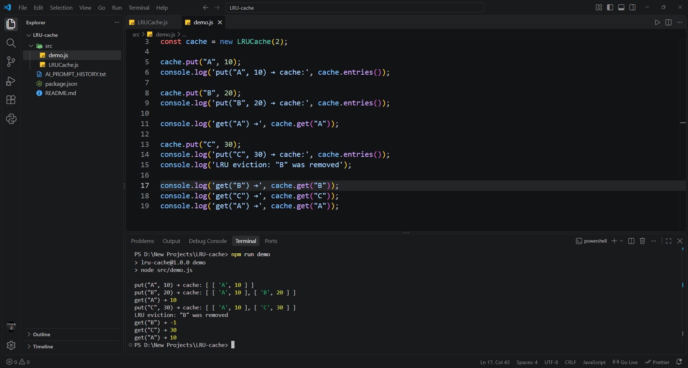

# LRU Cache

A JavaScript implementation of a Least Recently Used (LRU) cache.

The cache supports:

- `new LRUCache(capacity)`
- `get(key)`
- `put(key, value)`

## Requirements

- Node.js 18 or later

## Run the demo

```bash
npm run demo
```

## Example output

```text
put("A", 10) → cache: [ [ 'A', 10 ] ]
put("B", 20) → cache: [ [ 'A', 10 ], [ 'B', 20 ] ]
get("A") → 10
put("C", 30) → cache: [ [ 'A', 10 ], [ 'C', 30 ] ]
LRU eviction: "B" was removed
get("B") → -1
get("C") → 30
get("A") → 10
```

## Output screenshot



## How it works

The cache uses JavaScript's built-in `Map`.

`Map` preserves insertion order:

- The first entry is the least recently used item.
- The last entry is the most recently used item.
- When a key is accessed with `get()` or updated with `put()`, it is deleted and added again. This moves it to the most recently used position.
- When the cache exceeds its capacity, the first entry is removed.

## Example flow

For a cache with capacity `2`:

1. Add `A` and `B`.
2. Access `A`, making `A` the most recently used item.
3. Add `C`.
4. `B` is evicted because it is now the least recently used item.
5. `get("B")` returns `-1`.

## Time complexity

| Operation | Average time complexity |
|---|---:|
| `get(key)` | O(1) |
| `put(key, value)` | O(1) |

## Space complexity

The cache stores at most `capacity` entries.

**Space complexity: O(capacity)**